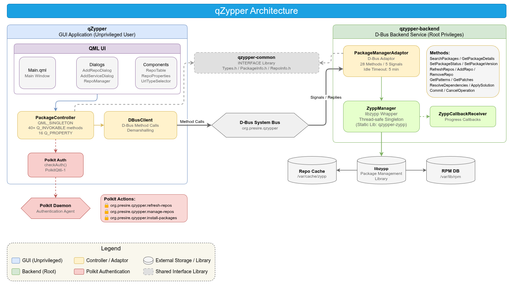
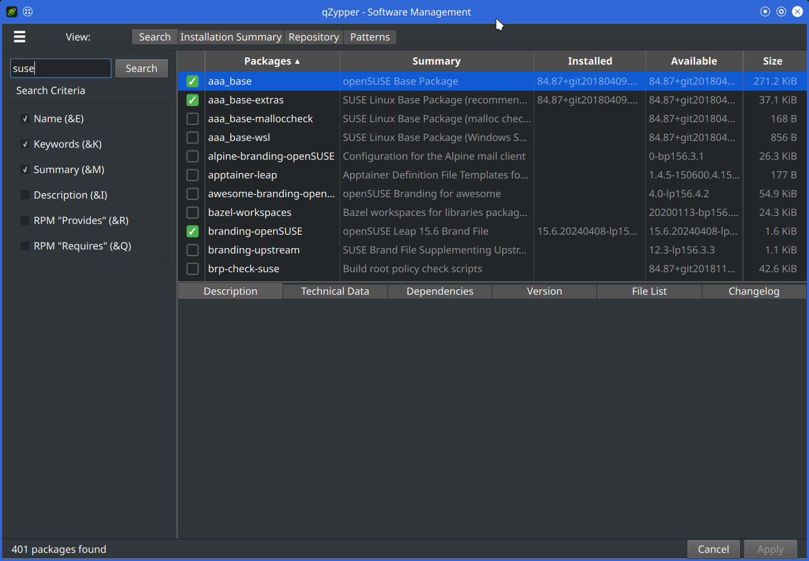
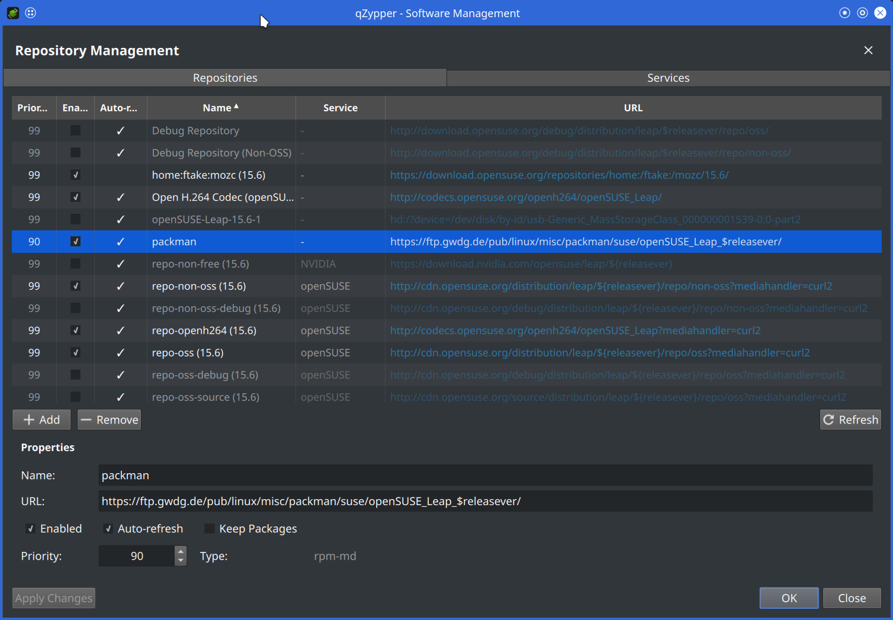
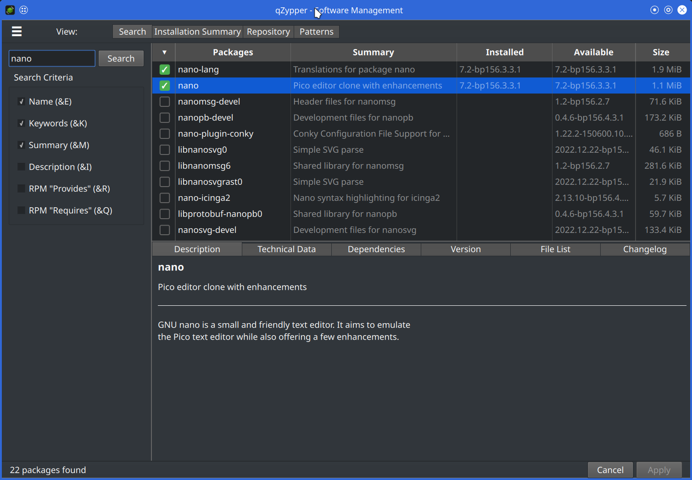

# qZypper

**A modern GUI package manager for openSUSE / SLE 16**  

[](LICENSE)
[](https://www.qt.io/)
[](https://isocpp.org/)
[](https://www.opensuse.org/)

> Successor to **YaST Software Management** and **YaST Repository Management**, built with Qt 6 (QML) and libzypp.  

---

<p align="center">
  
  
</p>

## Overview

qZypper is a graphical package management tool designed as a replacement for YaST Software Management and  
YaST Repository Management on openSUSE Leap 16 and SUSE Linux Enterprise 16.  

It provides a unified interface for managing packages,  
repositories, services, patterns, and patches through a modern Qt Quick UI,  
with privileged operations handled securely via D-Bus and Polkit authentication.  

## Features

### Package Management

- Search packages by name, keywords, summary, description, provides, requires, and file list
- View detailed package information (description, dependencies, changelog, file list)
- Install, update, and remove packages with dependency resolution
- Browse packages by repository or software pattern
- Select specific package versions from multiple repositories
- Set package status: install, update, delete, taboo, protected

### Repository Management

- List, add, remove, and modify repositories
- 2-step wizard for adding repositories with automatic type detection (rpm-md, yast2, etc.)
- Refresh individual or all repositories with progress indication
- Configure priority, auto-refresh, and package caching per repository

### Service Management

- Add, remove, and modify RIS/plugin package services
- Refresh services (auto-adds associated repositories)

### Pattern & Patch Management

- Browse and install software patterns grouped by category
- View and apply patches by category: security, recommended, optional, feature

### Dependency Resolution

- Automatic dependency resolution via libzypp solver
- Interactive conflict resolution with multiple solution options
- Preview pending changes before committing

### Security

- D-Bus privilege separation (GUI runs unprivileged, backend runs as root)
- Polkit authentication for privileged operations
- SELinux policy module for Leap 16 / SLE 16

### Internationalization

- English (default) and Japanese language support
- Automatic locale detection and translation loading

## User Interface

### Main Window Tabs

The header toolbar provides four view tabs.  

| Tab | Description |
|---|---|
| **Search** | Search packages by keyword with configurable search filters |
| **Installation Summary** | Review all pending changes (install / update / delete) before committing |
| **Repository** | Browse packages grouped by repository |
| **Patterns** | Browse and install software patterns grouped by category |

### Navigation Drawer

The hamburger menu (☰) opens a left-side drawer with the following sections.  

- **Packages** — Update All Packages, Apply Changes
- **Settings** — Manage Repositories, Refresh Repositories
- **Help** — About qZypper, About Qt
- **Quit**

### Repository Manager Drawer

A full-screen right-side drawer with two tabs.  

- **Repositories** — List, add, remove, and edit repositories with a properties panel (priority, enabled, auto-refresh, keep packages)
- **Services** — List, add, remove, and refresh RIS/plugin package services

### Package Details Pane

The bottom pane displays detailed information for the selected package across six tabs.  

| Tab | Content |
|---|---|
| **Description** | Package name, summary, and full description |
| **Technical Data** | Size, architecture, vendor, build time, etc. |
| **Dependencies** | Requires, provides, conflicts, obsoletes |
| **Version** | Available versions from all repositories with version selection |
| **File List** | Files included in the package |
| **Changelog** | Package change history |

### Refresh Progress Overlay

A modal overlay displayed during repository refresh operations,  
featuring a progress indicator, status message, and cancel button.  
Press `Escape` or click the cancel button to gracefully abort the operation after the current repository finishes.  

## Architecture

  

| Target | Type | Description |
|---|---|---|
| `qzypper` | Executable | GUI application (Qt Quick / QML) |
| `qzypper-backend` | Executable | D-Bus backend service (root, libzypp) |
| `qzypper-zypp` | Static library | ZyppManager (isolated from Qt D-Bus) |
| `qzypper-common` | Interface library | Shared type definitions (PackageInfo, RepoInfo, etc.) |

## Screenshots

<h3 align="center">Package Search</h3>

<p align="center">
  
</p>

<h3 align="center">Repository Management</h3>

<p align="center">
  
</p>

<h3 align="center">Package Details</h3>

<p align="center">
  
</p>

## Requirements

| Dependency | Version | Purpose |
|---|---|---|
| CMake | 3.21+ | Build system |
| GCC | 14.3+ | C++17 compiler |
| Qt 6 | 6.5+ | Core, Quick, QuickControls2, DBus, LinguistTools, Svg |
| libzypp | latest | Package management library |
| PolkitQt6-1 | latest | Polkit authentication (optional, with fallback) |
| boost_thread | latest | Thread management for ZyppManager |

## Build Dependencies (openSUSE)

Install the required development packages.  

```bash
sudo zypper install cmake gcc-c++ pkg-config \
  qt6-base-common-devel qt6-declarative-devel qt6-quick-devel \
  qt6-quickcontrols2-devel qt6-dbus-devel qt6-linguist-devel qt6-svg-devel \
  libzypp-devel libboost_thread-devel \
  libpolkit-qt6-1-devel
```

To build the SELinux policy module (optional):

```bash
sudo zypper install selinux-policy-devel
```

> **Note**:  
> If Qt 6.5+ is not available in the distribution repository (e.g. openSUSE Leap 15.x),  
> install it manually from the [Qt online installer](https://www.qt.io/download-qt-installer-oss) and specify the path via `-DCMAKE_PREFIX_PATH`.  

## Build

```bash
# Configure
cmake -B build -S . -DCMAKE_BUILD_TYPE=Release

# If Qt is installed in a custom location
cmake -B build -S . -DCMAKE_BUILD_TYPE=Release \
                    -DCMAKE_PREFIX_PATH=/path/to/Qt/6.5.3/gcc_64

# Build
cmake --build build
```

### Build Options

| Option | Default | Description |
|---|---|---|
| `ENABLE_SELINUX` | `ON` | Build and install SELinux policy module |

```bash
# Disable SELinux policy module
cmake -B build -S . -DCMAKE_BUILD_TYPE=Release -DENABLE_SELINUX=OFF
```

## Install

```bash
# Install to system
sudo cmake --install build

# Create RPM package
cd build && cpack -G RPM
```

### Installed Files

| File | Location |
|---|---|
| GUI binary | `/usr/bin/qzypper` |
| Backend binary | `/usr/libexec/qzypper-backend` |
| D-Bus config | `/usr/share/dbus-1/system.d/org.presire.qzypper.conf` |
| D-Bus service | `/usr/share/dbus-1/system-services/org.presire.qzypper.service` |
| Polkit policy | `/usr/share/polkit-1/actions/org.presire.qzypper.policy` |
| Desktop entry | `/usr/share/applications/org.presire.qzypper.desktop` |
| App icon | `/usr/share/icons/hicolor/{64x64,128x128,256x256,512x512,1024x1024}/apps/qZypper.png` |
| SELinux policy | `/usr/share/selinux/packages/qzypper.pp` |

## Directory Structure

```
qZypper/
├── src/
│   ├── common/                    # Shared types (PackageInfo, RepoInfo, Types)
│   ├── backend/                   # D-Bus backend service
│   │   ├── ZyppManager            #   libzypp wrapper (singleton)
│   │   ├── PackageManagerAdaptor  #   D-Bus adaptor
│   │   └── ZyppCallbackReceiver   #   Progress callbacks
│   └── gui/                       # GUI application
│       ├── controllers/           #   PackageController, DBusClient
│       └── qml/                   #   QML screens, dialogs, components
├── dbus/                          # D-Bus bus policy and service file
├── polkit/                        # Polkit action definitions
├── desktop/                       # Desktop entry template
├── selinux/                       # SELinux policy module
├── packaging/                     # RPM post-install/uninstall scripts
├── translations/                  # Japanese translation (.ts)
└── CMakeLists.txt                 # Top-level build configuration
```

## D-Bus Interface

- **Service**: `org.presire.qzypper`
- **Object path**: `/org/presire/qzypper`
- **Interface**: `org.presire.qzypper.PackageManager`
- **Bus**: System bus

### Backend (`qzypper-backend`) Lifetime

The backend is auto-started via D-Bus activation and terminates according to the following rules:

**1. Normal mode — Idle auto-exit (5 minutes)**

While only lightweight read-only operations (`GetRepos`, `SearchPackages`, `GetPackageDetails`, etc.) are issued (e.g. just after GUI startup), the backend auto-exits 5 minutes after the last D-Bus method call. This is a security measure to avoid leaving an unused root-privileged process running.

**2. After long-running operations — Idle timer permanently stopped**

Once **any** of the following methods is invoked even once, the idle timer is stopped and the backend keeps running until the GUI explicitly asks it to quit (unlimited lifetime).

| Method | Corresponding GUI action |
|---|---|
| `Commit` | Applying package install / uninstall / update |
| `RefreshRepos` | Refresh all repositories |
| `RefreshSingleRepo` | Refresh a single repository |
| `RefreshService` | Refresh a service |

Rationale: after these operations, the user is likely to spend time reviewing the result dialog or the updated repository list. If the backend died during that time, the next interaction would trigger a costly re-initialization (libzypp pool rebuild: seconds to tens of seconds), hurting UX. It also avoids losing in-memory libzypp state and debug logs mid-session.

**3. Temporary timer stop (during execution only)**

The following methods stop the idle timer only while executing and restart the 5-minute timer on completion. These may take tens of seconds to minutes, but are expected to be followed by lightweight reads:

- `AddRepo` / `AddRepoFull` (add repo + refreshMetadata + buildCache)
- `AddService` (add + refresh service)
- `UpdateAllPackages` (doUpdate + solver)
- `ResolveDependencies` (solver)

**4. On GUI exit — Explicit Quit**

When the qzypper GUI exits (`QCoreApplication::aboutToQuit`), `DBusClient::quit()` calls the backend's `Quit` D-Bus method, which cleanly terminates the backend process. `Ctrl+C` (SIGINT) and SIGTERM are handled via a self-pipe signal handler that routes through the same path, so the backend is always taken down together with the GUI.

**5. On backend crash — Auto-reconnect**

If the backend crashes unexpectedly, the GUI's `QDBusServiceWatcher` detects the service re-registration and automatically reconnects via the `backendReconnected` signal, which triggers `Initialize()` + `loadRepos()`. The user's session is not interrupted.


### Polkit Actions

| Action ID | Operation | Default |
|---|---|---|
| `org.presire.qzypper.refresh-repos` | Refresh repositories | auth_admin_keep |
| `org.presire.qzypper.manage-repos` | Add / remove / modify repos and services | auth_admin_keep |
| `org.presire.qzypper.install-packages` | Install / remove / update packages | auth_admin_keep |

### Methods

| Category | Method | Description |
|---|---|---|
| Initialization | `Initialize()` | Initialize libzypp |
| Repository | `GetRepos()` | Get repository list |
| | `RefreshRepos()` | Refresh all repositories |
| | `RefreshSingleRepo(alias)` | Refresh a single repository |
| | `AddRepo(url, name)` | Add repository (simple) |
| | `AddRepoFull(properties)` | Add repository (full properties) |
| | `RemoveRepo(alias)` | Remove repository |
| | `SetRepoEnabled(alias, enabled)` | Enable / disable repository |
| | `ModifyRepo(alias, properties)` | Modify repository properties |
| Service | `GetServices()` | Get service list |
| | `AddService(url, alias)` | Add service |
| | `RemoveService(alias)` | Remove service |
| | `ModifyService(alias, properties)` | Modify service properties |
| | `RefreshService(alias)` | Refresh service |
| Package | `SearchPackages(query, flags)` | Search packages |
| | `GetPackageDetails(name)` | Get package details |
| | `GetPackagesByRepo(repoAlias)` | Get packages by repository |
| | `GetPatterns()` | Get pattern list |
| | `GetPackagesByPattern(name)` | Get packages by pattern |
| | `GetPatches(category)` | Get patch list |
| | `GetPendingChanges()` | Get pending changes |
| Status | `SetPackageStatus(name, status)` | Change package status |
| | `SetPackageVersion(name, ver, arch, repo)` | Select specific package version |
| | `SetPatternStatus(name, status)` | Change pattern status |
| Update | `UpdateAllPackages()` | Update all packages (doUpdate) |
| Solver | `ResolveDependencies()` | Run dependency resolver |
| | `ApplySolution(problemIdx, solutionIdx)` | Apply conflict resolution |
| Commit | `Commit()` | Commit pending changes |
| State | `SaveState()` | Save selection state |
| | `RestoreState()` | Restore selection state |
| Other | `GetDiskUsage()` | Get disk usage info |
| | `CancelOperation()` | Cancel current operation |
| | `Quit()` | Shut down backend |

### Signals

| Signal | Description |
|---|---|
| `ProgressChanged(packageName, percentage, stage)` | Operation progress |
| `CommitProgressChanged(packageName, percentage, stage, totalSteps, completedSteps, overallPercentage)` | Detailed commit progress |
| `TransactionFinished(success, summary)` | Transaction completed |
| `RepoRefreshProgress(repoAlias, percentage)` | Repository refresh progress |
| `ErrorOccurred(errorMessage)` | Error notification |

## Configuration File

qZypper stores user preferences in `~/.config/Presire/qZypper.conf` (INI format, managed by Qt's `Settings` type).  
This file is created automatically on first launch and updated when the application exits.  

### Saved Settings

| Category | Key | Description |
|---|---|---|
| `window` | `width`, `height` | Main window size |
| `splitView` | `leftPaneWidth`, `detailPaneHeight` | Splitter positions (left pane and detail pane) |
| `packageTable` | `colName`, `colSummary`, `colInstalled`, `colAvailable` | Package table column widths |
| `repoTable` | `colPriority`, `colEnabled`, `colAutoRefresh`, `colName`, `colService` | Repository table column widths |
| `serviceTable` | `colEnabled`, `colName`, `colType` | Service table column widths |

All settings are optional. If the file is deleted, defaults are restored on next launch.  

## Keyboard Shortcuts

| Shortcut | Action |
|---|---|
| `[Ctrl] + [Q]` | Quit application |
| `[Ctrl] + [Enter]` | Apply pending changes |
| `[Esc]` | Close current drawer / dialog |

## License

This project is licensed under the **GNU General Public License v2.0 or later** - see the [LICENSE](LICENSE) file for details.  

Copyright (C) 2026 Presire  

## Author

**Presire**  

- GitHub: [https://github.com/presire/qZypper](https://github.com/presire/qZypper)
