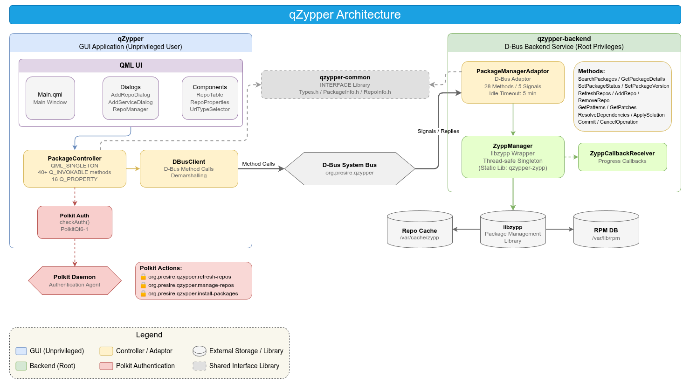
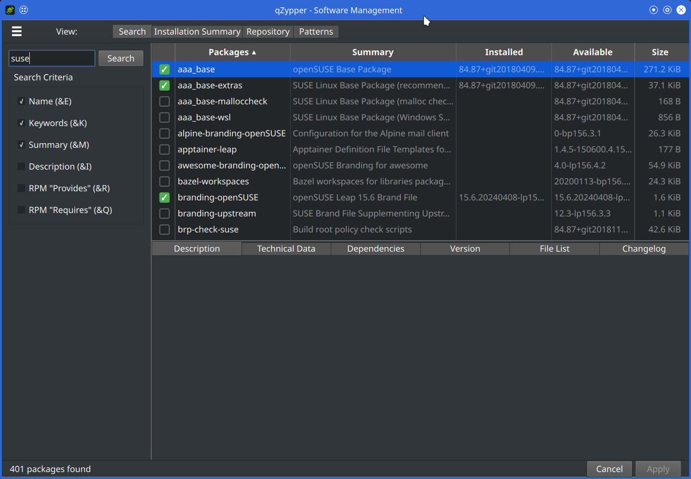
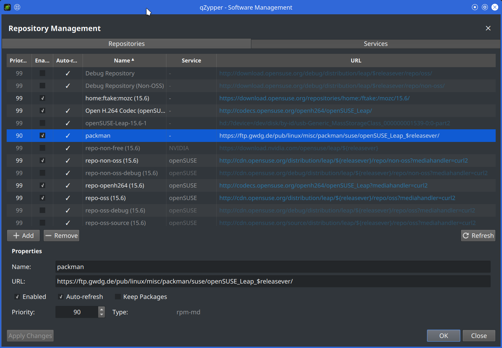
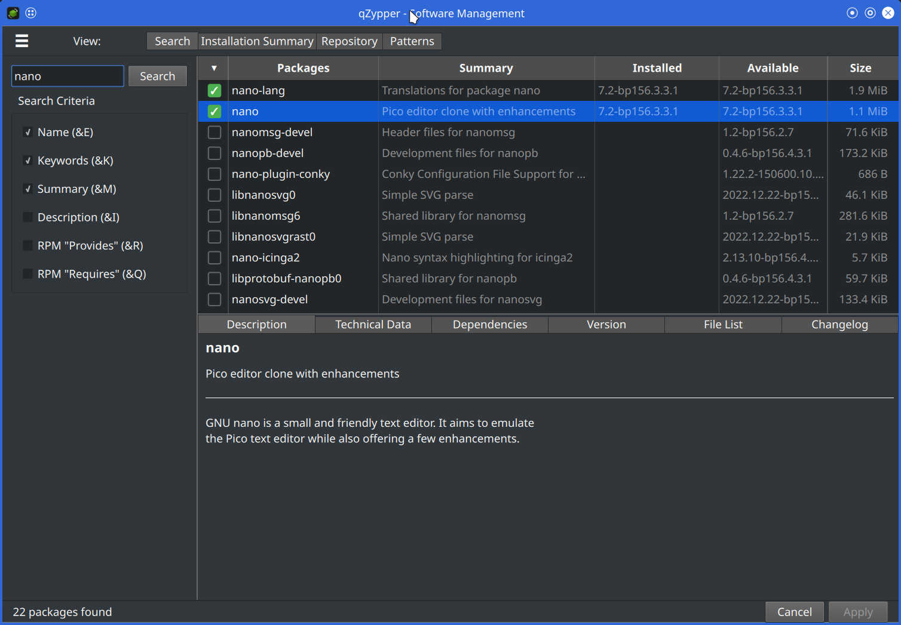

# qZypper

**A modern GUI package manager for openSUSE Leap 16 / SLE 16**  

[](LICENSE)
[](https://www.qt.io/)
[](https://isocpp.org/)
[](https://www.opensuse.org/)

> Successor to **YaST Software Management** and **YaST Repository Management**, built with Qt 6 (QML) and libzypp.  

---

<p align="center">
  
  
</p>

## Overview

qZypper is a graphical package management tool designed as a replacement for YaST Software Management and  
YaST Repository Management on openSUSE Leap 16 and SUSE Linux Enterprise 16.  

It provides a unified interface for managing packages,  
repositories, services, patterns, and patches through a modern Qt Quick UI,  
with privileged operations handled securely via D-Bus and Polkit authentication.  

## Features

### Package Management

- Search packages by name, keywords, summary, description, provides, requires, and file list
- View detailed package information (description, dependencies, changelog, file list)
- Install, update, and remove packages with dependency resolution
- Browse packages by repository or software pattern
- Select specific package versions from multiple repositories
- Set package status: install, update, delete, taboo, protected

### Repository Management

- List, add, remove, and modify repositories
- 2-step wizard for adding repositories (URL, then properties) with URL scheme validation
- Refresh individual or all repositories with progress indication
- Configure priority, auto-refresh, and package caching per repository

### Service Management

- Add, remove, and modify RIS/plugin package services
- Refresh services (auto-adds associated repositories)

### Pattern & Patch Management

- Browse and install software patterns grouped by category
- View and apply patches by category: security, recommended, optional, feature

### Dependency Resolution

- Automatic dependency resolution via libzypp solver
- Interactive conflict resolution with multiple solution options
- Preview pending changes before committing

### Security

- D-Bus privilege separation (GUI runs unprivileged, backend runs as root)
- systemd-managed D-Bus activation (backend runs as root under a dedicated systemd service)
- Environment sanitization in the systemd unit (fixed `HOME`/`PATH`, inherited variables unset)
- Polkit authentication for privileged operations
- SELinux policy module for Leap 16 / SLE 16
- Dedicated SELinux GPG-agent socket type (`qzypper_gpg_agent_socket_t`) with a socket type transition (policy configuration)

### Internationalization

- English (default) and Japanese language support
- Automatic locale detection and translation loading

## User Interface

### Main Window Tabs

The header toolbar provides four view tabs.  

| Tab | Description |
|---|---|
| **Search** | Search packages by keyword with configurable search filters |
| **Installation Summary** | Review all pending changes (install / update / delete) before committing |
| **Repository** | Browse packages grouped by repository |
| **Patterns** | Browse and install software patterns grouped by category |

### Navigation Drawer

The hamburger menu (☰) opens a left-side drawer with the following sections.  

- **Packages** — Update All Packages, Apply Changes
- **Settings** — Manage Repositories, Refresh Repositories
- **Help** — About qZypper, About Qt
- **Quit**

### Repository Manager Drawer

A full-screen right-side drawer with two tabs.  

- **Repositories** — List, add, remove, and edit repositories with a properties panel (priority, enabled, auto-refresh, keep packages)
- **Services** — List, add, remove, and refresh RIS/plugin package services

### Package Details Pane

The bottom pane displays detailed information for the selected package across six tabs.  

| Tab | Content |
|---|---|
| **Description** | Package name, summary, and full description |
| **Technical Data** | Size, architecture, vendor, build time, etc. |
| **Dependencies** | Requires, provides, conflicts, obsoletes |
| **Version** | Available versions from all repositories with version selection |
| **File List** | Files included in the package |
| **Changelog** | Package change history |

### Refresh Progress Overlay

A modal overlay displayed during repository refresh operations,  
featuring a progress indicator, status message, and cancel button.  
Press `Escape` or click the cancel button to gracefully abort the operation after the current repository finishes.  

## Architecture

  

| Target | Type | Description |
|---|---|---|
| `qzypper` | Executable | GUI application (Qt Quick / QML) |
| `qzypper-backend` | Executable | D-Bus backend service (root, libzypp) |
| `qzypper-zypp` | Static library | ZyppManager (isolated from Qt D-Bus) |
| `qzypper-common` | Interface library | Shared type definitions (PackageInfo, RepoInfo, etc.) |

## Screenshots

<h3 align="center">Package Search</h3>

<p align="center">
  
</p>

<h3 align="center">Repository Management</h3>

<p align="center">
  
</p>

<h3 align="center">Package Details</h3>

<p align="center">
  
</p>

## Requirements

| Dependency | Version | Purpose |
|---|---|---|
| CMake | 3.21+ | Build system |
| GCC | 14.3+ | C++17 compiler |
| Qt 6 | 6.5+ | Core, Quick, QuickControls2, DBus, LinguistTools, Svg |
| libzypp | latest | Package management library |
| PolkitQt6-1 | latest | Polkit authentication (optional, with fallback) |
| Boost.Thread | 1.86+ | Thread management for ZyppManager (imported Boost::thread target linked into qzypper-zypp) |

## Build Dependencies (openSUSE)

Install the required development packages.  

```bash
sudo zypper install cmake gcc-c++ pkg-config \
  qt6-base-common-devel qt6-declarative-devel qt6-quick-devel \
  qt6-quickcontrols2-devel qt6-dbus-devel qt6-linguist-devel qt6-svg-devel \
  libzypp-devel libboost_thread-devel \
  libpolkit-qt6-1-devel
```

To build the SELinux policy module (optional):

```bash
sudo zypper install selinux-policy-devel
```

> **Note**:  
> If Qt 6.5+ is not available in the distribution repository (e.g. openSUSE Leap 15.x),  
> install it manually from the [Qt online installer](https://www.qt.io/download-qt-installer-oss) and specify the path via `-DCMAKE_PREFIX_PATH`.  

## Build

```bash
# Configure
cmake -B build -S . -DCMAKE_BUILD_TYPE=Release

# If Qt is installed in a custom location
cmake -B build -S . -DCMAKE_BUILD_TYPE=Release \
                    -DCMAKE_PREFIX_PATH=/path/to/Qt/6.5.3/gcc_64

# Build
cmake --build build
```

### Build Options

| Option | Default | Description |
|---|---|---|
| `ENABLE_SELINUX` | `ON` | Build and install SELinux policy module |

```bash
# Disable SELinux policy module
cmake -B build -S . -DCMAKE_BUILD_TYPE=Release -DENABLE_SELINUX=OFF
```

## Install

```bash
# Install to system
sudo cmake --install build

# Create RPM package
cd build && cpack -G RPM
```

### Installed Files

| File | Location |
|---|---|
| GUI binary | `/usr/bin/qzypper` |
| Backend binary | `/usr/libexec/qzypper-backend` |
| D-Bus config | `/usr/share/dbus-1/system.d/org.presire.qzypper.conf` |
| D-Bus service | `/usr/share/dbus-1/system-services/org.presire.qzypper.service` |
| systemd unit | `/usr/lib/systemd/system/dbus-org.presire.qzypper.service` (default, controlled by `SYSTEMD_SYSTEM_UNIT_DIR`) |
| Polkit policy | `/usr/share/polkit-1/actions/org.presire.qzypper.policy` |
| Desktop entry | `/usr/share/applications/org.presire.qzypper.desktop` |
| App icon | `/usr/share/icons/hicolor/{64x64,128x128,256x256,512x512,1024x1024}/apps/qZypper.png` |
| SELinux policy | `/usr/share/selinux/packages/qzypper.pp` |

## Directory Structure

```
qZypper/
├── src/
│   ├── common/                    # Shared types (PackageInfo, RepoInfo, Types)
│   ├── backend/                   # D-Bus backend service
│   │   ├── ZyppManager            #   libzypp wrapper (singleton)
│   │   ├── PackageManagerAdaptor  #   D-Bus adaptor
│   │   └── ZyppCallbackReceiver   #   Progress callbacks
│   └── gui/                       # GUI application
│       ├── controllers/           #   PackageController, DBusClient
│       └── qml/                   #   QML screens, dialogs, components
├── dbus/                          # D-Bus bus policy and service file
├── systemd/                       # systemd D-Bus activation unit
├── polkit/                        # Polkit action definitions
├── desktop/                       # Desktop entry template
├── selinux/                       # SELinux policy module
├── packaging/                     # RPM post-install/uninstall scripts
├── translations/                  # Japanese translation (.ts)
└── CMakeLists.txt                 # Top-level build configuration
```

## D-Bus Interface

- **Service**: `org.presire.qzypper`  
- **Object path**: `/org/presire/qzypper`  
- **Interface**: `org.presire.qzypper.PackageManager`  
- **Bus**: System bus  

### Backend Activation (systemd)

D-Bus activation delegates to a systemd service instead of starting the backend binary directly. The D-Bus service file sets `SystemdService=dbus-org.presire.qzypper.service`, so the system bus asks systemd to launch the unit.

The systemd unit (`systemd/dbus-org.presire.qzypper.service.in`) describes a root backend service:  

- `Type=dbus` with `BusName=org.presire.qzypper`: systemd considers the service started once the bus name is acquired.  
- `User=root`: the backend runs with root privileges for libzypp operations.  
- `ExecStart` points at `/usr/libexec/qzypper-backend`.  

The unit fixes the process environment and unsets inherited variables:  

- `Environment=HOME=/root` and a fixed `PATH` (`/usr/local/sbin:/usr/local/bin:/usr/sbin:/usr/bin:/sbin:/bin`).  
- `UnsetEnvironment=` removes the dynamic loader variables (`LD_LIBRARY_PATH`, `LD_PRELOAD`, `LD_AUDIT`, `GLIBC_TUNABLES`), the XDG directory variables,  
  GnuPG variables (`GNUPGHOME`, `GPG_AGENT_INFO`), the session D-Bus address (`DBUS_SESSION_BUS_ADDRESS`), the Qt/QML import path variables,  
  and the libzypp override variables (`ZYPP_CONF`, `ZYPP_REPO_RELEASEVER`, `ZYPP_PLUGIN_*`).  

The backend therefore starts with a deterministic environment rather than inheriting the activating caller's.  

### Backend (`qzypper-backend`) Lifetime

The backend is auto-started by D-Bus activation. It has no explicit shutdown method; its lifetime is governed by an idle timer and by the session owner's connection:  

- A single-shot 5-minute idle timer starts when the backend starts.  
- The timer is stopped while a worker operation runs and restarted when the operation finishes.  
- Calls from the session owner restart the timer.  
- When the timer fires, the backend exits if no operation is running and no `Initialize` authorization is pending. Otherwise it re-arms and waits again.  

When the session owner's D-Bus connection disappears (GUI exit or crash), the backend does not hand the session to another client. It exits immediately if idle, or right after the currently running operation completes.  

There is no "idle timer permanently stopped after long-running operations" mode.  

On normal GUI exit (`Ctrl` + `Q` → `Qt.quit()`) the GUI's bus connection closes, which triggers the rule above. If the backend crashes unexpectedly, the GUI's `QDBusServiceWatcher` detects the service re-registration and reconnects automatically: the `backendReconnected` signal triggers `Initialize()` and a repository reload. The user's session is not interrupted.

### Authorization and Ownership

- On startup the GUI calls `Initialize()`. The backend asks Polkit (action `org.presire.qzypper.initialize`, admin authentication) for the caller's unique bus name (subject kind `system-bus-name`). Only if that authorization succeeds does the connection become the session **owner**, and libzypp is initialized.  
- Other clients receive `org.freedesktop.DBus.Error.AccessDenied` with the message "Another client owns the qZypper session".  
- Pending `Initialize` authorizations are bounded: one per connection, at most 2 per Unix user (UID, resolved via `org.freedesktop.DBus.GetConnectionUnixUser`), and at most 8 overall. Excess requests receive `org.freedesktop.DBus.Error.LimitsExceeded`.  
- Every privileged method is authorized server-side again with Polkit for the caller's bus name: `org.presire.qzypper.refresh-repos`, `org.presire.qzypper.manage-repos`, `org.presire.qzypper.install-packages`, and `org.presire.qzypper.trust-key`.  
- Mutating methods are owner-only. Only one operation runs at a time: a single worker thread executes it and the D-Bus reply is delayed until it finishes. Concurrent calls fail with `org.presire.qzypper.Error.Busy`. `CancelOperation()` (owner only) requests cooperative cancellation through a cancellation token.  
- `Commit(t expectedRevision)`: the GUI reads the current selection revision with `GetSelectionRevision()` and passes it back. Dependencies must have been resolved for that exact revision, otherwise the call is rejected with `org.presire.qzypper.Error.SelectionChanged`.  
- When a new GPG key is needed, the backend emits `UntrustedKeyDetected(a{sv})` carrying the fingerprint. Signature and digest problems are always rejected. The user approves the exact fingerprint in the GUI, which calls `TrustKey(s fingerprint)` (Polkit `trust-key`). This records a one-shot approval: the key is imported only when the user retries the operation (for example, refresh again).  
- Progress and state signals (`ProgressChanged`, `CommitProgressChanged`, `RepoRefreshProgress`, `TransactionFinished`, `ErrorOccurred`, `PackageStateChanged`, `UntrustedKeyDetected`) are unicast: they are sent only to the session owner, not broadcast to the bus.  

### Polkit Actions

| Action ID | Operation | Default |
|---|---|---|
| `org.presire.qzypper.initialize` | Open a package management session (become session owner) | auth_admin (active: auth_admin_keep) |
| `org.presire.qzypper.refresh-repos` | Refresh repositories | auth_admin_keep |
| `org.presire.qzypper.manage-repos` | Add / remove / modify repos and services | auth_admin_keep |
| `org.presire.qzypper.install-packages` | Install / remove / update packages | auth_admin_keep |
| `org.presire.qzypper.trust-key` | Trust a new repository signing key | auth_admin |

### Methods

| Category | Method | Description |
|---|---|---|
| Initialization | `Initialize()` | Open the session (owner only) and initialize libzypp |
| Repository | `GetRepos()` | Get repository list |
| | `RefreshRepos()` | Refresh all repositories |
| | `RefreshSingleRepo(alias)` | Refresh a single repository |
| | `TrustKey(fingerprint)` | Approve a repository signing key (one-shot) |
| | `AddRepo(url, name)` | Add repository (simple) |
| | `AddRepoFull(properties)` | Add repository (full properties) |
| | `RemoveRepo(alias)` | Remove repository |
| | `SetRepoEnabled(alias, enabled)` | Enable / disable repository |
| | `ModifyRepo(alias, properties)` | Modify repository properties |
| Service | `GetServices()` | Get service list |
| | `AddService(url, alias)` | Add service |
| | `RemoveService(alias)` | Remove service |
| | `ModifyService(alias, properties)` | Modify service properties |
| | `RefreshService(alias)` | Refresh service |
| Package | `SearchPackages(query, flags)` | Literal, case-insensitive substring search (see below) |
| | `GetPackageDetails(name)` | Get package details |
| | `GetPackagesByRepo(repoAlias)` | Get packages by repository |
| | `GetPatterns()` | Get pattern list |
| | `GetPackagesByPattern(patternName)` | Get packages by pattern |
| | `GetPatches(category)` | Get patch list |
| | `GetPendingChanges()` | Get pending changes |
| Status | `SetPackageStatus(name, status)` | Change package status |
| | `SetPackageVersion(name, version, arch, repoAlias)` | Select specific package version |
| | `SetPatternStatus(name, status)` | Change pattern status |
| Update | `UpdateAllPackages()` | Update all packages (doUpdate) |
| Solver | `ResolveDependencies()` | Run dependency resolver |
| | `ApplySolution(problemIndex, solutionIndex)` | Apply conflict resolution |
| Commit | `GetSelectionRevision()` | Get the current selection revision |
| | `Commit(expectedRevision)` | Commit the confirmed selection revision |
| State | `SaveState()` | Save selection state |
| | `RestoreState()` | Restore selection state |
| Other | `GetDiskUsage()` | Get disk usage info |
| | `CancelOperation()` | Request cooperative cancellation (owner only) |

Privileged and mutating methods are subject to the authorization and owner rules described above. Read-only queries are not owner-gated.

### Package Search

`SearchPackages(query, flags)` performs literal (not regular-expression) matching: it returns packages whose text contains the query as an ASCII-case-insensitive substring. A query longer than 256 bytes is rejected with `org.freedesktop.DBus.Error.InvalidArgs`.

The `flags` bitmask (`SearchFlag`) selects which fields are searched; all flags are honoured:

| Flag | Value | Field |
|---|---|---|
| `Name` | 1 | Package name |
| `Keywords` | 2 | Package keywords |
| `Summary` | 4 | Summary |
| `Description` | 8 | Description |
| `Requires` | 16 | Requires dependencies |
| `Provides` | 32 | Provides dependencies |
| `FileList` | 64 | File list (only files available in the loaded metadata / installed packages) |

### Repository URL Validation

Repository URLs are validated before use. The scheme must be one of `http`, `https`, `ftp`, `tftp`, `file`, `dir`, `hd`, `iso`, `cd`, `dvd`, `nfs`, `nfs4`, `smb`, or `cifs` (`plugin` and other schemes are rejected). For `iso` URLs, a nested `url` query parameter is validated recursively. Repository aliases allow at most 200 bytes, must not start with `.`, and must not contain `/`, `\`, `[`, `]`, or control characters. Display names allow at most 1024 bytes and must not contain control characters.

### Signals

| Signal | Description |
|---|---|
| `ProgressChanged(packageName, percentage, stage)` | Operation progress |
| `CommitProgressChanged(packageName, percentage, stage, totalSteps, completedSteps, overallPercentage)` | Detailed commit progress |
| `TransactionFinished(success, summary)` | Transaction completed |
| `RepoRefreshProgress(repoAlias, percentage)` | Repository refresh progress |
| `ErrorOccurred(errorMessage)` | Error notification |
| `PackageStateChanged(packageName, event)` | Package state transition during commit |
| `UntrustedKeyDetected(keyInfo)` | Untrusted signing key detected (`a{sv}` including the fingerprint) |

These signals are unicast: they are sent only to the session owner, not broadcast to all bus clients.

## Configuration File

qZypper stores user preferences in `~/.config/Presire/qZypper.conf` (INI format, managed by Qt's `Settings` type).  
This file is created automatically on first launch and updated when the application exits.  

### Saved Settings

| Category | Key | Description |
|---|---|---|
| `window` | `width`, `height` | Main window size |
| `splitView` | `leftPaneWidth`, `detailPaneHeight` | Splitter positions (left pane and detail pane) |
| `packageTable` | `colName`, `colSummary`, `colInstalled`, `colAvailable` | Package table column widths |
| `repoTable` | `colPriority`, `colEnabled`, `colAutoRefresh`, `colName`, `colService` | Repository table column widths |
| `serviceTable` | `colEnabled`, `colName`, `colType` | Service table column widths |

All settings are optional. If the file is deleted, defaults are restored on next launch.  

## Keyboard Shortcuts

| Shortcut | Action |
|---|---|
| `[Ctrl] + [Q]` | Quit application |
| `[Ctrl] + [Enter]` | Apply pending changes |
| `[Esc]` | Close current drawer / dialog |

## License

This project is licensed under the **GNU General Public License v2.0 or later** - see the [LICENSE](LICENSE) file for details.  

Copyright (C) 2026 Presire  

## Author

**Presire**  

- GitHub: [https://github.com/presire/qZypper](https://github.com/presire/qZypper)
